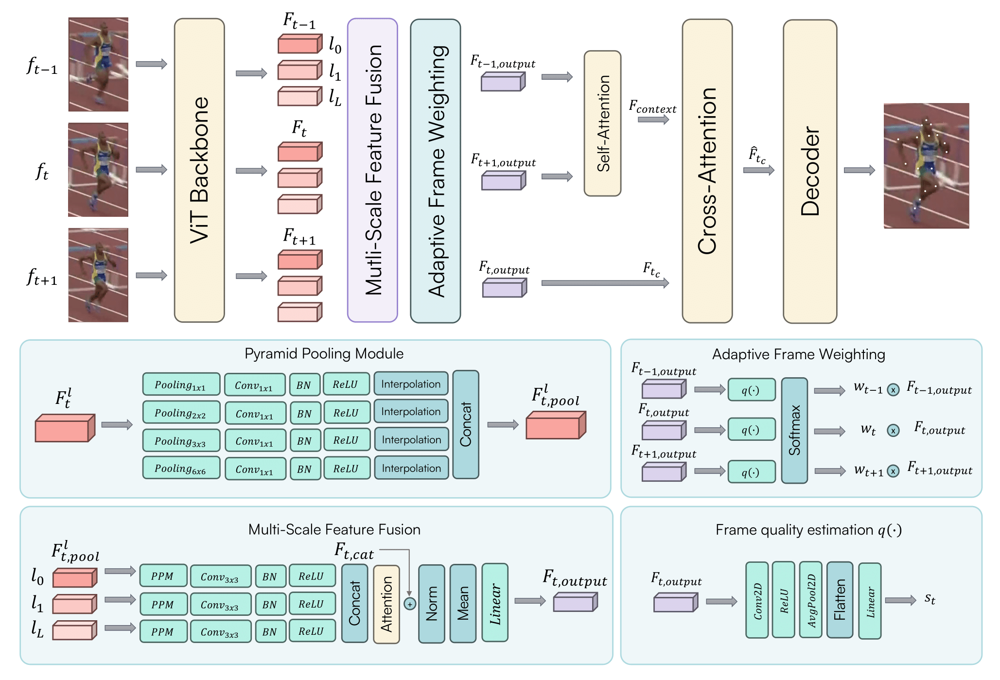

# Poseidon: A ViT-based Architecture for Multi-frame Pose Estimation with Adaptive Frame Weighting and Multi-scale Feature Fusion

This repository is the official implementation for **Poseidon: A ViT-based Architecture for Multi-frame Pose Estimation with Adaptive Frame Weighting and Multi-scale Feature Fusion**. 

[**Read the paper on arXiv**](https://arxiv.org/abs/xxxx.xxxxx)

## Abstract
Human pose estimation, a vital task in computer vision, involves detecting and localizing human joints in images and videos. While single-frame pose estimation has seen significant progress, it often fails to capture the temporal dynamics for understanding complex, continuous movements. We propose **Poseidon**, a novel multi-frame pose estimation architecture that extends the ViTPose model by integrating temporal information for enhanced accuracy and robustness to address these limitations. Poseidon introduces key innovations: (1) an Adaptive Frame Weighting (AFW) mechanism that dynamically prioritizes frames based on their relevance, ensuring that the model focuses on the most informative data; (2) a Multi-Scale Feature Fusion (MSFF) module that aggregates features from different backbone layers to capture both fine-grained details and high-level semantics; and (3) a Cross-Attention module for effective information exchange between central and contextual frames, enhancing the model’s temporal coherence. The proposed architecture improves performance in complex video scenarios and offers scalability and computational efficiency suitable for real-world applications.
Our approach achieves state-of-the-art performance on the PoseTrack21 and PoseTrack18 datasets, achieving mAP scores of 88.3 and 87.8, respectively, outperforming existing methods. 



### Quantitative Results on the PoseTrack18 Dataset

| Method            | Head  | Shoulder | Elbow | Wrist | Hip   | Knee  | Ankle | **Mean** |
|-------------------|-------|----------|-------|-------|-------|-------|-------|----------|
| PoseWarper        | 79.9  | 86.3     | 82.4  | 77.5  | 79.8  | 78.8  | 73.2  | 79.7     |
| DCPose            | 84.0  | 86.6     | 82.7  | 78.0  | 80.4  | 79.3  | 73.8  | 80.9     |
| DetTrack          | 84.9  | 87.4     | 84.8  | 79.2  | 77.6  | 79.7  | 75.3  | 81.5     |
| FAMI-Pose         | 85.5  | 87.8     | 84.2  | 79.2  | 81.4  | 81.1  | 74.9  | 82.2     |
| DiffPose          | 85.0  | 87.7     | 84.3  | 81.5  | 81.4  | 82.9  | 77.6  | 83.0     |
| DSTA              | 85.9  | 88.8     | 85.0  | 81.1  | 81.5  | 83.0  | 77.4  | 83.4     |
| TDMI-ST           | 86.7  | 88.9     | 85.4  | 80.6  | 82.4  | 82.1  | 77.6  | 83.6     |
| JM-Pose           | 90.7  | 91.6     | 87.8  | 82.1  | 85.9  | 85.3  | 79.2  | 84.1     |
| **Poseidon (Ours)** | **88.8** | **91.4** | **88.6** | **86.3** | **83.3** | **88.8** | **87.2** | **87.8** |

### Quantitative Results on the PoseTrack21 Dataset

| Method            | Head  | Shoulder | Elbow | Wrist | Hip   | Knee  | Ankle | **Mean** |
|-------------------|-------|----------|-------|-------|-------|-------|-------|----------|
| Tracktor++ w. poses | -     | -        | -     | -     | -     | -     | -     | 71.4     |
| CorrTrack         | -     | -        | -     | -     | -     | -     | -     | 72.3     |
| CorrTrack w. ReID | -     | -        | -     | -     | -     | -     | -     | 72.7     |
| Tracktor++ w. corr. | -     | -        | -     | -     | -     | -     | -     | 73.6     |
| DCPose            | 83.2  | 84.7     | 82.3  | 78.1  | 80.3  | 79.2  | 73.5  | 80.5     |
| FAMI-Pose         | 83.3  | 85.4     | 82.9  | 78.6  | 81.3  | 80.5  | 75.3  | 81.2     |
| DiffPose          | 84.7  | 85.6     | 83.6  | 80.8  | 81.4  | 83.5  | 80.0  | 82.9     |
| DSTA              | 87.5  | 87.0     | 84.2  | 81.4  | 82.3  | 82.5  | 77.7  | 83.5     |
| TDMI-ST           | 86.8  | 87.4     | 85.1  | 81.4  | 83.8  | 82.7  | 78.0  | 83.8     |
| JM-Pose           | 85.8  | 88.1     | 85.7  | 82.5  | 84.1  | 83.1  | 78.5  | 84.0     |
| **Poseidon (Ours)** | **92.2** | **90.8** | **88.3** | **85.8** | **85.5** | **87.7** | **85.7** | **88.3** |

Evaluation is performed using the official PoseTrack evaluation code, poseval, which uses py-motmetrics internally.

## Environment
* Python version:  3.11.6

* PyTorch version:  2.0.1

* Cuda version: 12.0


```
conda create -n poseidon pyhton=3.11.6

pip install -U openmim

conda install pytorch==2.0.1 torchvision==0.15.2 torchaudio==2.0.2 pytorch-cuda=11.8 -c pytorch -c nvidia

mim install mmengine
mim  install "mmcv==2.1.0"
mim  install "mmdet==3.2.0"
mim  install "mmpose==1.3.1"
mim  install "mmpretrain==1.2.0"

conda env update --file environment.yml

```

for further details regarding the installation of MMPose refer to [**MMPose install**](https://mmpose.readthedocs.io/en/latest/installation.html)

## Data preparation

### Sub-JHMDB Datset
The directory stucture must be:
```
dataJHMDB
    -- annotations
        -- split1
            -- train
            -- val
        -- split2
        -- split3
    -- images/Rename_Images
    -- jsons
        -- split1
            -- val.json
            -- train.json
        -- split2
        -- split3
```
The dataset can be downloaded from [**JHMDB Site**](http://jhmdb.is.tue.mpg.de) and the annotations from [**MMPose Source**](https://mmpose.readthedocs.io/en/latest/dataset_zoo/2d_body_keypoint.html) 

Once the annotations have been downloaded, use add_crown.py for each annotations file to adapt the format to coco format and rename it with "posetrack_train.json" or "posetrack_val.json".
```
python notebook/add_crown.py --file_path dataJHMDB/jsons/split1/Sub1_train.json
# remember to rename the file
```
After this, use separeta_json.py to generate json files for each frame.
```
python separate_json.py --input_file dataJHMDB/jsons/split1/posetrack_val.json --output_folder dataJHMDB/annotations/split1/val
```


### Posetrack18 and Posetrack21

The dataset can be downloaded from [**Posetrack download**](https://github.com/anDoer/PoseTrack21) and the structure of the dataset must be:
```
dataPosetrack18
    -- annotations
        -- train
        -- val
    -- images
        -- train
        -- val
    -- json
        -- posetrack_train.json
        -- posetrack_val.json
```


```
dataPosetrack21
    -- annotations
        -- train
        -- val
    -- images
        -- train
        -- val
    -- json
        -- posetrack_train.json
        -- posetrack_val.json
```

## Pretrained Weights for ViTPose

The pretrained weights for ViTPose can be downloaded from the [MMPose Model Zoo](https://mmpose.readthedocs.io/en/latest/model_zoo/body_2d_keypoint.html).

## Usage
For training and validation, refer to the config files present in the configs folder.

### Training
```
python train.py --config /path/to/config/config.yaml 
```
### Validation
```
python val.py --config /path/to/config/config.yaml --weights_path /path/to/weights.pt
```

## Citations

## Acknowledgment
Our codes are mainly based on [**DCPOSE**](https://github.com/Pose-Group/DCPose) and [**MMPose**](https://mmpose.readthedocs.io/en/latest/). Thanks to the authors!